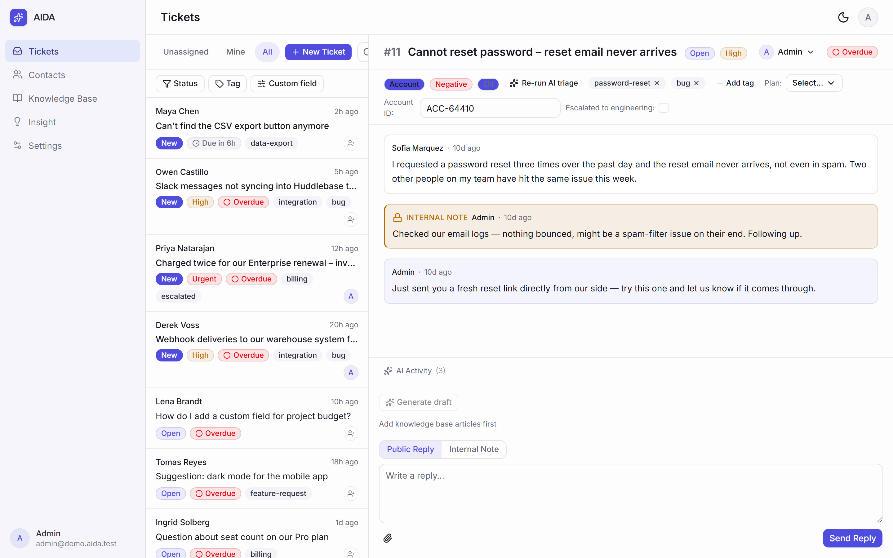
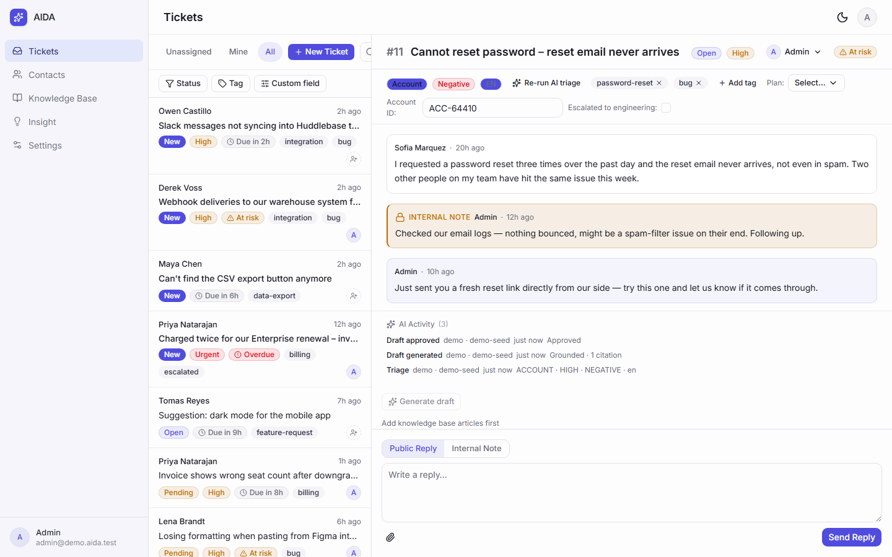
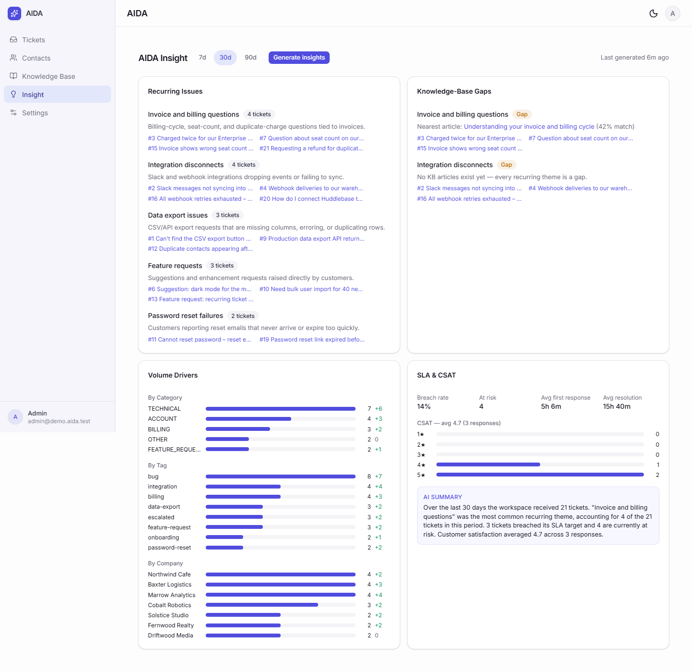
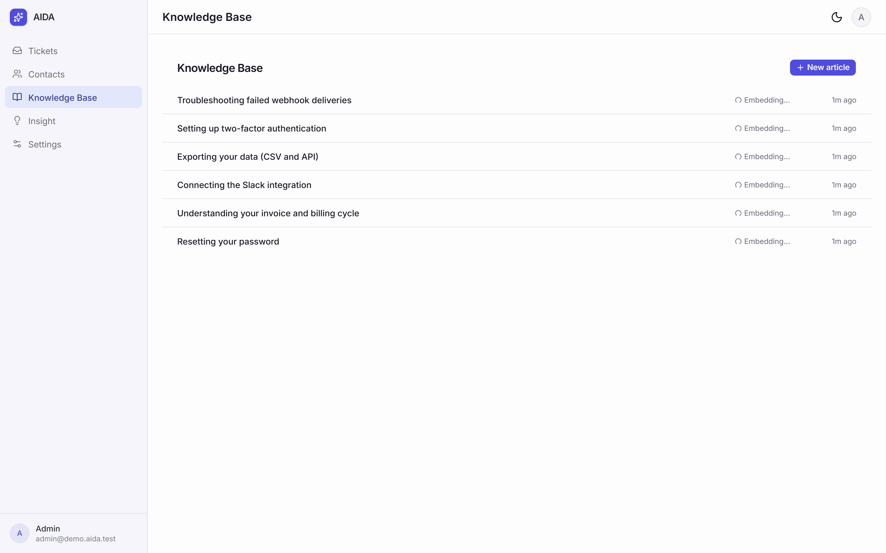

<div align="center">

# AIDA

### The open-source, AI-native helpdesk you can self-host.

Bring your own LLM — OpenAI, Anthropic, or a local model via Ollama.
Your tickets stay on your server — the only egress is to the LLM, SMTP, or IMAP endpoints you
configure yourself. No per-resolution fees from AIDA.

[](https://github.com/afrizzal/aida/actions/workflows/ci.yml)
[](LICENSE)
[](https://afrizzal.github.io/aida)
<!-- release badge: add once v1.0.0 is tagged (Plan 07-12) -->


*Shared inbox → ticket triage → a cited AI-drafted reply, approved and sent by a human → AIDA Insight.
The drafted-reply segment above was recorded live against a local Ollama-protocol stub for a
reproducible capture — in real use, AIDA talks to OpenAI, Anthropic, or a real local Ollama model.*

</div>

---

## Why AIDA

Most helpdesk software treats AI as a paywalled add-on with per-resolution fees, while your ticket data lives on someone else's servers.

**AIDA is different:** AI is the *core*, not an afterthought. Self-host it on your own server, point it at any LLM (including a fully local one via Ollama), and keep every ticket on your own infrastructure — the only network egress is to the LLM provider and mail server you configure yourself. AIDA charges no per-resolution fees; your own LLM provider may still bill you directly for API usage.

## Features

| | |
|---|---|
| 🎟️ **Modern ticketing** | Shared inbox with views, filters and full-text search. Ticket lifecycle NEW → OPEN → PENDING → RESOLVED → CLOSED. Contacts with full history, tags, custom fields, assignment, internal notes vs public replies, SLA first-response/resolution timers with at-risk/breached states. |
| 🌐 **Public portal** | A public web intake form plus a tokenised ticket-status page with follow-up replies and CSAT capture — no login required for your customers. |
| 📧 **Email channel** | Inbound email threading and outbound SMTP replies, alongside the web form and portal. |
| 🧠 **AI auto-triage** | Every incoming ticket is classified — category, priority, sentiment, language — with agent override, and every AI action is written to an append-only audit log. |
| ✍️ **RAG drafted replies** | Suggested replies grounded in your knowledge base (pgvector embeddings), **with citations**, behind a human-approval gate — no silent AI sends. |
| 📊 **AIDA Insight** | AI-driven analytics, not just dashboards: recurring-issue clustering, knowledge-gap detection, ticket-volume drivers, SLA/CSAT insight. |
| ⚙️ **Workspace settings** | Branding, SLA policies, tags/custom fields, email channel, and AI provider config — all admin-gated. |
| 🔌 **Bring your own LLM** | OpenAI, Anthropic, or local via Ollama. Your keys, your models, your data. Turn AI fully off anytime — the helpdesk keeps working. |
| 🐳 **One-command self-host** | `docker compose up` — app, Postgres + pgvector, queue (pg-boss, no Redis) and reverse proxy, all on a single server. Backup/restore scripts included. |

## Quick start

```bash
git clone https://github.com/afrizzal/aida.git
cd aida
cp .env.example .env
# set POSTGRES_PASSWORD, and generate three secrets:
#   openssl rand -base64 32   -> BETTER_AUTH_SECRET, RATE_LIMIT_PEPPER, APP_ENCRYPTION_KEY
docker compose up -d
```

Open **http://localhost** (Caddy serves ports 80/443 in front of the app; `http://localhost:3000` is the
`pnpm dev` URL for local development, not the compose URL). Health check: `curl http://localhost/api/health`.

First run: complete the `/setup` wizard, or set `ADMIN_EMAIL`/`ADMIN_PASSWORD` in `.env` beforehand for a
headless install.

## Try the demo

Want to look around a populated helpdesk first? Set `DEMO_MODE=true` in your `.env` before
the first `docker compose up` and AIDA loads a fictional support workspace — 30 tickets across
every status and SLA state, contacts, a knowledge base, CSAT responses and three AIDA Insight
runs — then sign in with the credentials in `.env.example`.

The demo's AI results (triage, drafted replies, Insight runs) are **stored data**, so every AI surface
renders populated without any provider configured. Live AI actions — generating a new draft, running
Insight again, re-running triage — still require a configured OpenAI, Anthropic, or local Ollama
provider.

**Never enable demo mode on an internet-facing instance** — its credentials are published in
`.env.example` and this README.

## How AIDA compares

| | **AIDA** | Hosted SaaS helpdesks (Zendesk, Intercom, …) | Open-source helpdesks (e.g. Chatwoot) |
|---|---|---|---|
| **Licence** | Apache-2.0, source-available and self-hostable | Typically proprietary and hosted-only | Varies by project (most are open source) |
| **Where your ticket data lives** | Your server | Typically the vendor's cloud | Varies by project — your server if self-hosted |
| **AI in the core product** | Included, no separate AI plan | Typically a paid add-on or higher tier | Typically an add-on or paid tier |
| **Choice of LLM** | Bring your own: OpenAI, Anthropic, or a fully local model via Ollama | Usually the vendor's own model | Usually a fixed vendor integration |
| **Per-resolution AI fees** | None; you pay your LLM provider directly | Commonly metered per AI resolution | Varies |
| **AI can be turned off entirely** | Yes, and the helpdesk keeps working | Depends on the plan | Varies |
| **Setup** | One `docker compose up` on a single server | Typically a vendor-hosted sign-up, no install | Typically self-host, though hosted options exist for some projects |

> Comparison reflects how these product categories are commonly positioned, not a feature-by-feature audit
> of any specific vendor. Vendors change their plans; check their own documentation for current details.
> The AIDA column describes what this repository does today.

### When AIDA is not the right choice

- You want a fully managed SaaS with an uptime SLA and a support contract to call when something breaks.
- You need a mature marketplace of third-party integrations and pre-built apps.
- You need multi-brand or multi-workspace administration in the UI today — the data model is
  multi-tenant-ready, but v1 ships a single workspace in the UI, and there is currently no in-product
  way to invite a second team member to a workspace.
- You're not comfortable operating a server yourself, including its backups and updates.
- You need live chat / real-time messaging — AIDA starts with web-form and email intake; live chat isn't built yet.

## Screenshots

<p align="center"></p>

*The shared inbox — filters, SLA chips, and the two-pane reading view.*

<p align="center"></p>

*A ticket with a citation-backed AI draft, waiting for a human to approve or edit before it sends.*

<p align="center"></p>

*AIDA Insight — recurring-issue clustering, knowledge-gap detection, volume drivers, and an SLA/CSAT summary.*

<p align="center"></p>

*The knowledge base that grounds every drafted reply's citations.*

Dark-theme variants of every screenshot (and more) live in [`docs/assets/`](docs/assets/).

## Tech stack

Next.js (App Router) + TypeScript · PostgreSQL 16 + pgvector (vector store) · pg-boss (Postgres-backed
queue — no Redis) · Prisma · Tailwind + shadcn/ui · Caddy · Docker Compose. Single-server by design —
easy to run, easy to read.

## Documentation

- **[Docs site](https://afrizzal.github.io/aida)** — install, configuration, AI setup per provider, KB & RAG usage, AIDA Insight, operations
- [`docs/ARCHITECTURE.md`](docs/ARCHITECTURE.md) — system design and data flow
- [`docs/OPERATIONS.md`](docs/OPERATIONS.md) — backups, upgrades, logs, full env reference
- [`docs/SECURITY.md`](docs/SECURITY.md) — privacy and security model
- [`docs/BRIEF.md`](docs/BRIEF.md) — positioning and product brief

## Status

**v1 — Minimum Lovable Helpdesk.** Core ticketing, email/web intake, AI triage, RAG drafted replies,
AIDA Insight, and one-command self-host are all shipped. Built in the open with a phased roadmap — see
[`.planning/ROADMAP.md`](.planning/ROADMAP.md). Star and watch to follow along.

## Contributing

Contributions welcome — see [`CONTRIBUTING.md`](CONTRIBUTING.md) for the dev setup and conventions, and
[`CODE_OF_CONDUCT.md`](CODE_OF_CONDUCT.md) for community expectations. Found a security issue? Please
don't open a public issue — see [`.github/SECURITY.md`](.github/SECURITY.md) for the private disclosure
process.

## License

[Apache-2.0](LICENSE).
